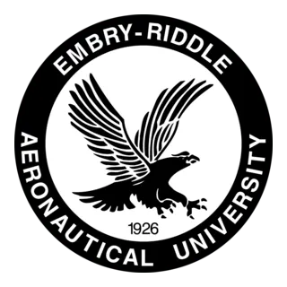
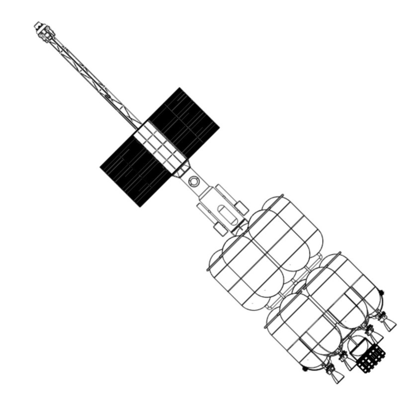
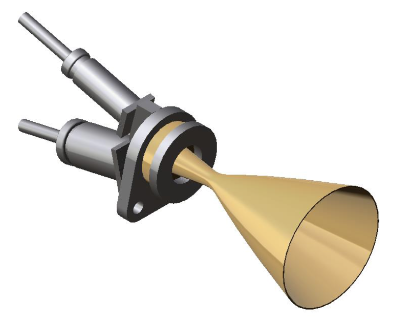
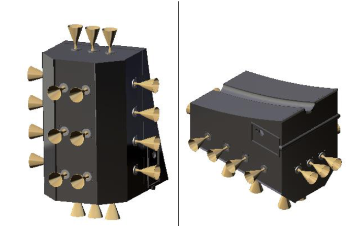

# Hi, I'm Mason Dunsmuir
##  Aerospace Engineer | Propulsion Specialist | Mechanical Designer

<table>
  <tr>
    <td valign="top" width="70%">
      <strong>Embry-Riddle Aeronautical University</strong> 
      <em>Daytona Beach, FL</em>  
      <strong>Bachelor of Science, Aerospace Engineering</strong> 
      <strong>2021 – 2025</strong> 
      <ul>
        <li><strong>Area of Concentration:</strong> Rocket Propulsion</li>
        <li><strong>Area of Interest:</strong> System Integration</li>
        <li><strong>GPA:</strong> 3.21 / 4.00</li>
      </ul>
    </td>
    <td width="30%">
      
    </td>
  </tr>
</table>

## Aerospace Engineering Projects (the super cool ones)
---
<h3>WARDEN – Mars Mission (RCS System Lead)</h3>

  
  
  

As the lead for the Reaction Control System (RCS), I was responsible for designing and validating thruster configurations for a multi-stage spacecraft targeting a Mars transit mission. My work involved calculating torque balances, optimizing thruster orientation, and performing GNC simulations to support precision maneuvering, docking, and abort scenarios. I also contributed to subsystem integration, line routing, and propulsion documentation as part of the Chemical Propulsion and Dynamics team.

**Mission Overview:**
- [High-Level Mission Report](High-Level_Mission_Report.pdf)

**Engineering Deliverables:**
- [RCS Thruster Configuration & GNC Simulation Report](WARDEN_RCS_System_Report.pdf) — *My primary contribution*
- [Final Certification](Final_Certification.pdf)
- [Final Assembly Documentation](Final_Assembly_Report.pdf)
- [Tank and Cryocooler System Report](Tank_and_Cryocooler_System_Report.pdf)
- [Team Testing Procedures](Chemical_Team_Testing_Procedures_Documentation.pdf)
- [Chemical Engine Design Report](Chemical_Engine_System_Report.pdf)
- [FMEA – Chemical Subsystems](ChemicalFMEA.pdf)
---
### Shock Tube Design & Testing

Developed modular test section and transparent window for high-speed Schlieren visualization. Integrated pressure transducers and DAQ systems.

- [Shock Tube Final Report (PDF)](Shock_Tube_Final_Report.pdf)  
- [Watch Schlieren Demo (YouTube)](https://youtu.be/UaHGwScwaRw)

---

### CATIA Projects & Certifications

Completed surface and solid modeling in CATIA V5. Earned five Dassault Systèmes certifications in part design, assembly, drafting, and surfacing.

- [CATIA Certifications – Dassault Systèmes (PDF)](Catia.Certs.2025.pdf)
- [CATIA Project Gallery (WIP)](EngineAssembly.pdf)

---

## About Me

I’m a senior at Embry-Riddle Aeronautical University majoring in Aerospace Engineering with a focus in rocket propulsion and a minor in computational mathematics. I combine hands-on prototyping with system-level simulation. My work spans high-speed testing, spacecraft dynamics, and CAD-to-manufacturing integration.
### View My General Resume HERE
- [General Resume (JULY 2025)](Dunsmuir.ResumeJuly.pdf)  

## Connect with Me

**Email:** [mwdunsmuir@gmail.com](mailto:mwdunsmuir@gmail.com)  
**LinkedIn:** [linkedin.com/in/mason-dunsmuir](https://www.linkedin.com/in/mason-dunsmuir)
