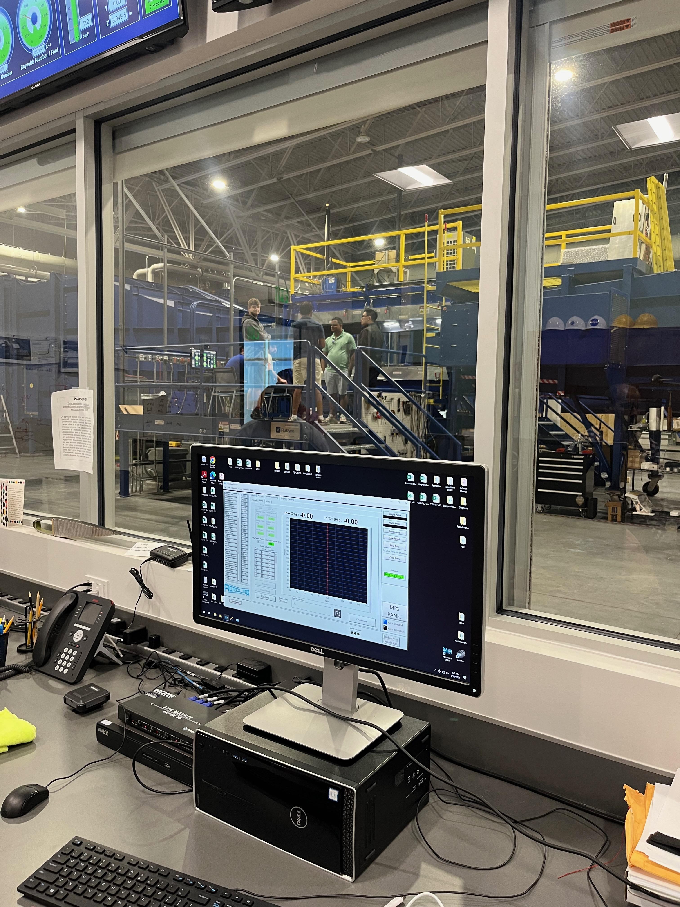

# Hi, I'm Mason Dunsmuir
##  Aerospace Engineer | Propulsion Specialist | Mechanical Designer

<table>
  <tr>
    <td valign="top" width="70%">
      <strong>Embry-Riddle Aeronautical University</strong> 
      <em>Daytona Beach, FL</em>  
      <strong>Bachelor of Science, Aerospace Engineering</strong> 
      <strong>2021 – 2025</strong> 
      <ul>
        <li><strong>Area of Concentration:</strong> Rocket Propulsion</li>
        <li><strong>Area of Interest:</strong> System Integration</li>
        <li><strong>GPA:</strong> 3.21 / 4.00</li>
      </ul>
    </td>
    <td width="30%">
      
    </td>
  </tr>
</table>

[See My Resume](Dunsmuir.ResumeJuly.pdf)  

## Aerospace Engineering Projects (the super cool ones)
---
<h3>WARDEN – Mars Mission (RCS System Lead)</h3>

  
  
  

As the lead for the Reaction Control System (RCS), I was responsible for designing and validating thruster configurations for a multi-stage spacecraft targeting a Mars transit mission. My work involved calculating torque balances, optimizing thruster orientation, and performing GNC simulations to support precision maneuvering, docking, and abort scenarios. I also contributed to subsystem integration, line routing, and propulsion documentation as part of the Chemical Propulsion and Dynamics team.

**Mission Overview:**
- [High-Level Mission Report](High-Level_Mission_Report.pdf)

**Engineering Deliverables:**
- [RCS Thruster Configuration & GNC Simulation Report](WARDEN_RCS_System_Report.pdf) — *My primary contribution*
- [Final Certification](Final_Certification.pdf)
- [Final Assembly Documentation](Final_Assembly_Report.pdf)
- [Tank and Cryocooler System Report](Tank_and_Cryocooler_System_Report.pdf)
- [Team Testing Procedures](Chemical_Team_Testing_Procedures_Documentation.pdf)
- [Chemical Engine Design Report](Chemical_Engine_System_Report.pdf)
- [FMEA – Chemical Subsystems](ChemicalFMEA.pdf)

---

### Shock Tube Design & Testing

Developed modular test section and transparent window for high-speed Schlieren visualization. Integrated pressure transducers and DAQ systems.

- [Shock Tube Final Report (PDF)](Shock_Tube_Final_Report.pdf)
- See The Demo!  

---

### CATIA Projects & Certifications

Completed surface and solid modeling in CATIA V5. Earned five Dassault Systèmes certifications in part design, assembly, drafting, and surfacing.

- [CATIA Certifications – Dassault Systèmes (PDF)](Catia.Certs.2025.pdf)
- [CATIA Project Gallery (WIP)](EngineAssembly.pdf)

---

## About Me

I’m a senior at Embry-Riddle Aeronautical University majoring in Aerospace Engineering with a focus in rocket propulsion and a minor in computational mathematics. I combine hands-on prototyping with system-level simulation. My work spans high-speed testing, spacecraft dynamics, and CAD-to-manufacturing integration.

### View My General Resume HERE

---

## 🧪 Specialty Lab Experience

Hands-on lab work at Embry-Riddle involving aerodynamic testing, pressure mapping, and supersonic flow characterization. These setups reflect direct application of instrumentation, flow visualization, and model-based data acquisition.

---

### Supersonic Wind Tunnel (SST)

High-speed testing lab used for flow diagnostics and component behavior in supersonic regimes. Includes test section with instrumentation and control interface for Mach-based experiments.

  
  
  

---

### Subsonic Wind Tunnel – Airfoil Pressure Mapping

This test used a multi-port airfoil model with surface pressure taps routed through flexible tubing to collect pressure readings. Data enabled the generation of Cp vs. x/c plots and boundary layer visualization.

  
  

## Falcon Launches from Daytona Beach

Witnessing launches from Daytona Beach is inspiring to say the least. Watching the thunderbirds soar overhead during the day and the rockets crawl through the clouds with little to no warning instills me with a burning passion. These photos were taken on/near my campus, capturing Falcon 9 rockets piercing the sky.

  
  
  

---

## Connect with Me

**Email:** [mwdunsmuir@gmail.com](mailto:mwdunsmuir@gmail.com)  
**LinkedIn:** [linkedin.com/in/mason-dunsmuir](https://www.linkedin.com/in/mason-dunsmuir)
